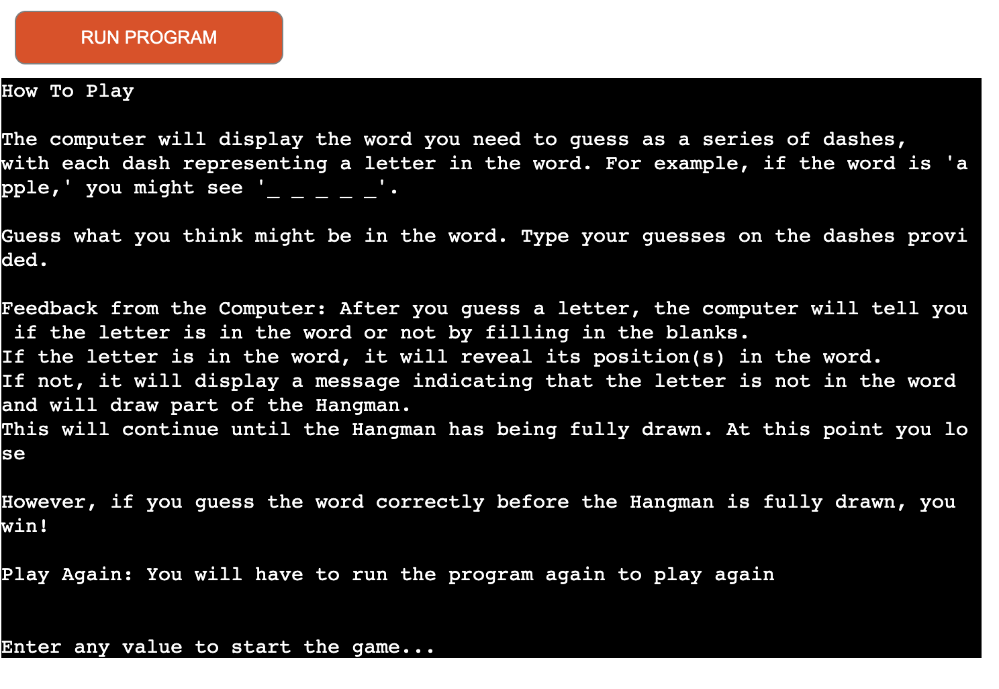
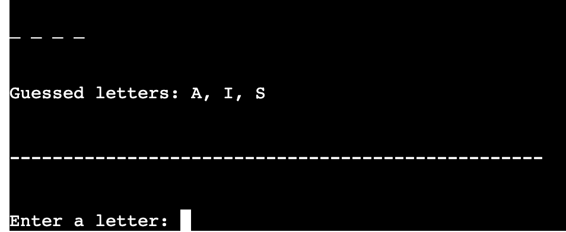
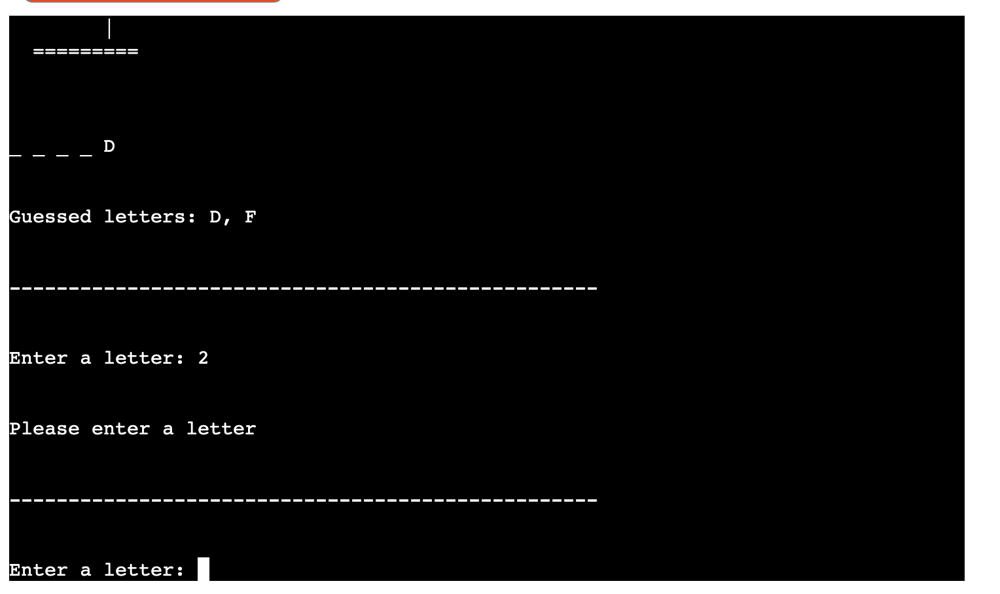
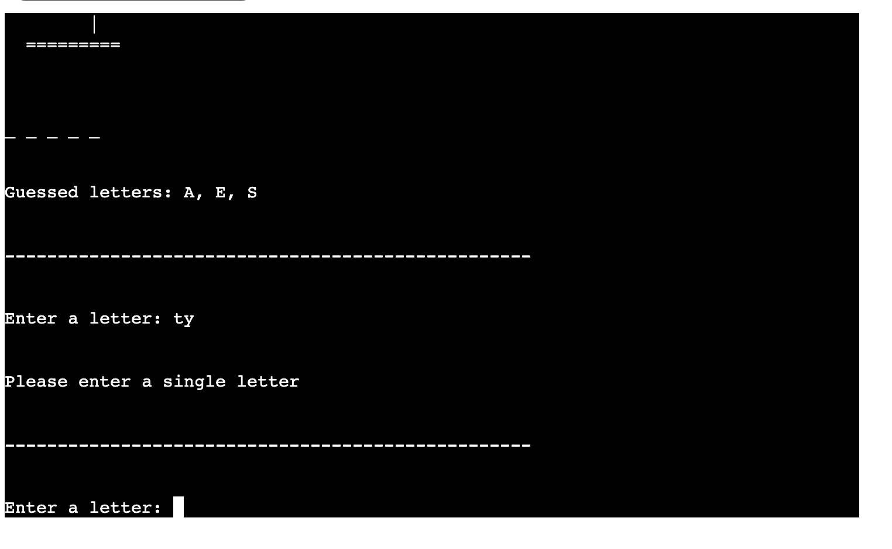
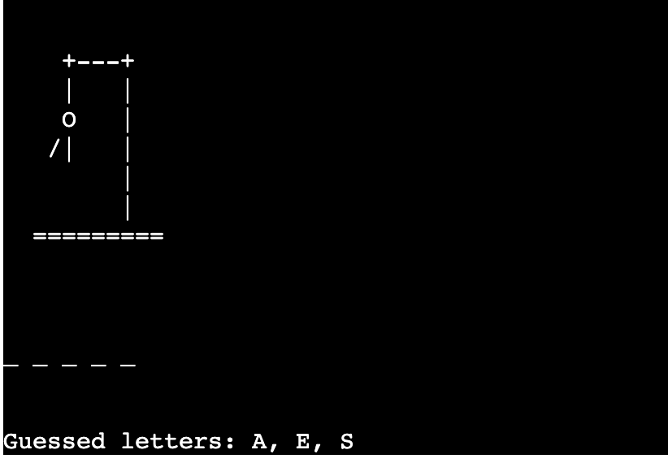
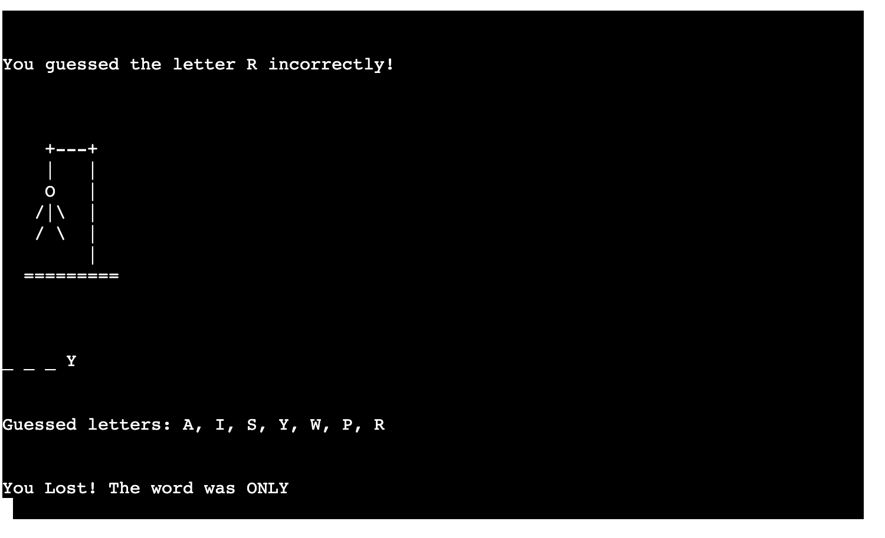
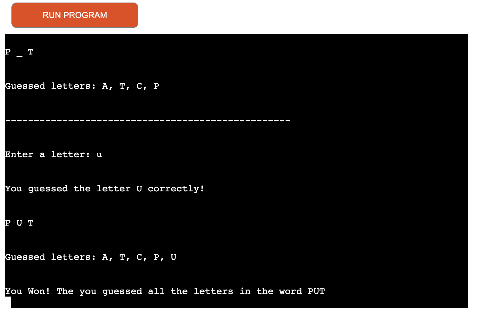
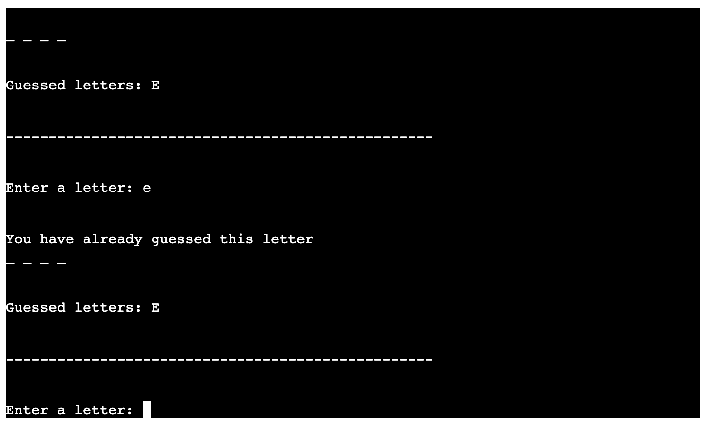
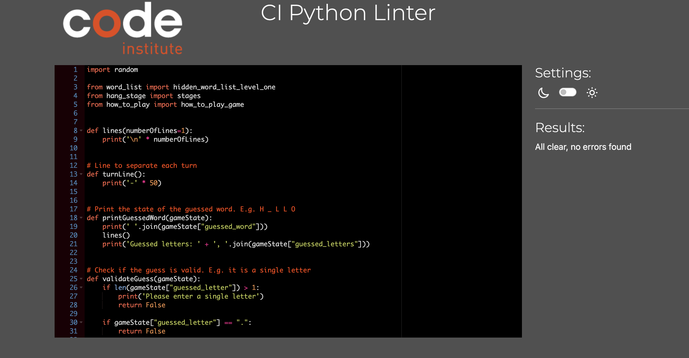

# **Hangman Game**

**Hangman** is a word guessing game. Its a fun and exciting for all ages. 

[Link to live project](https://hangman-ayisha-95e25d9ad6cd.herokuapp.com/)

## Overview 

 I decided to create this project because of my son. I thought it could be a fun and interactive way for him to improve on his spelling while playing. 

## **Planning**

### **Intended Users**

* Users who love guessing games.
* Kids Learning to spell.
* Users looking for a productive way to pass the time.

### **User Stories**

* As a user, I want to know the main intention of the site.
* As a user I want to see the game rules clearly written.
* As a user I want to play, learn and have fun.
* As a user I want to be able to navigate through the site easily.

### **Goals**

* Make game easy to navigate through.
* Provide a free guessing game.
* Provide simple and short rules of the game.

## How it works

- At the start of the game it shows the display "Welcome to Hangman Game" in ASCII Art. 
- The player will be asked to type the letter h for help/ how to play or to press 'Enter' to start the game

- The How to play screen explains how the game is played from this screen you can press 'Enter' to start the game

 

- The Game page will ask the user to guess a letter 
- These letters are saved as to remind the player a their of previous guesses 

- The User can only chose letters from A - Z. If the user tries to enter any other character they will be asked to enter a letter

- The User can only make a guess of 1 single letter for each attempt 

- When a user continues to make incorrect guesses parts will be added to the hangman stand 

 

- As incorrect guesses are made the body parts of the hangman will be added limb by limb and the game will be over

- The correct word will be displayed for the user to see

- When a User wins the game they are told of this and the game exits automatically

- Informs user when they typed a letter more that once

## Future Features:

- In the Future I would like to add more levels to the game by adding longer words to the challenge I would also love to create the game where 2 players can play 

## Design:

I used a paper and pencil to structure my entire project. My first structure was done to get to game working, perform validations and get an idea of how I wanted to program to work. I then structured this logic and wrote it into functions and called them to run the game.

## Testing:

- I have manaully tested the project using CI Python Linter with no errors showing. 

## Bugs:

- Incorrectly indenting my code was an issue. I would constantly receive errors regarding this, However this wasnt too hard to fix

- After writing this piece of code:
    random_word = 'away'
    guessed_word = '_' * len(random_word)

    prints __
    print(guessed_word)

    guessed_letter = 'w'

    Thought this would change the 2nd character in guessed_word from '_' to 'w'
    intead a throws an error
    TypeError: 'str' object does not support item assignment
    guessed_word[1] = guessed_letter

    After some research I saw that I needed to convert it to a list instead
    guessed_word = list(guessed_word)
    guessed_word[1] = guessed_letter

    prints w_

## Deployment:

### **Deploying to Heroku**

Code Institute Python Essentials Template was used for this project so the python code can be viewed in a terminal in a browser:
1. Create a Heroku account
2. Click "New" and select "Create new app"
3. Enter unique app name and select region
4. Click "Create app"
5. On the next page find "Settings" 
6. Add "Buildpacks" to add both "Python" and "Node.js"
7. Scroll to the top and select "Deploy" tab
8. Select GitHub as deployment method and search for your repository, once found click "Connect"
9. Scroll down and choose between "Enable Automatic Deploys" so the code is updated every time it is pushed to Git

## Credits:

-  My amazing husband for his support during my late night studying. Thank you loads

- To my mentor who always know what to say to keep me going!! The information, support and guidance! I could ask for a better mentor "see I did as you advised and added the functions to the application "Big Thanks!

- My dear friend Gianluca from the Slack community who is always ready to share whatever he has learnt and give tips

- Kite and Jenny's Lectures CS IT on Youtube 

- My dear friend Kyle who to always ready to proofread my application last minute 

- To www.w3schools.com for easy access to everything Python at your finger tips

- Omar for proofreading my application providing feedback and reminding me to always go back to pen and paper for better understaning

- Slack Community 

- Code Institue for loads of information on the topic

## Content:

- The ASCII came from the (www.asciiart.eu) website. 
- Chat GPT for How to Play text